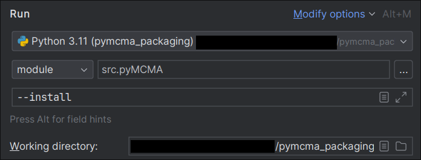

# Running development version

1. Git clone the repository

2. Enter the repository directory

3. Create the virual environment in this directory, using for example
```bash
$ python -m venv venv
```

4. Activate virtual envitornment:
```bash
$ source venv/bin/activate
```

5. Install the development dependencies:
```bash
$ pip install -r requirments.txt
```

6. **Optional**: Run the module with `--install` argument to initialize
working directory:
```bash
$ python -m src.pyMCMA --install
```

This will create such directories as `Models/`, `Templates/`, and `anaTst/` in
the root of the repository. Next, it will run the analysis on the example model.

7. **Optional**: Run the module with `--anaDir` to run your own analysis.
```bash
$ python -m src.pyMCMA --anaDir your_analysis_dir
```
Notice, that `your_analysis_dir` should contain `cfg.yml` file which is
described in the documentation.


# Running development version (PyCharm)

1. Git clone the repository

2. Open the repository directory in the PyCharm

3. Create the virual environment in this directory, using for example
```bash
$ python -m venv venv
```

4. Activate virtual envitornment:
```bash
$ source venv/bin/activate
```

5. Install the development dependencies:
```bash
$ pip install -r requirments.txt
```

6. Example execution configuration:
    - Interpreter from the virtual environment
    - Module instead of script, with path `src.pyMCMA`
    - `--install` or `--anaDir your_dir` as a command line arguments.
    - Absolute path to the desired working directory (root of the repository in the example).




# Packaging

To create and then install the package follow the next steps:

1. Ensure that your previously created virtual environment is active and you
is in the root of the repository (directory with `pyproject.toml`) file.
2. Run the following command to build the packages:
```bash
$ python -m build
```
This will create `dist/` directory with two files. Then we should install
one of them (no matter which one) using `pip`:
```bash
$ pip install dist/pyMCMA-1.0.0.tar.gz
```
3. After the installation you should be able to run `pymcma` command.
4. **Optional:** Create and enter the empty directory.
5. **Optional:** Run `pymcma` with `--install` argument to initialize
working directory:
```bash
$ pymcma --install
```

This will create such directories as `Models/`, `Templates/`, and `anaTst/` in
the current directory. Next, it will run the analysis on the example model.

7. **Optional**: Run the `pymcma` with `--anaDir` to run your own analysis.
```bash
$ pymcma --anaDir your_analysis_dir
```
Notice, that `your_analysis_dir` should contain `cfg.yml` file which is
described in the documentation.


# Installation (after we will upload it to Pypi)

1. Create and activate virtual environment in the chosen directory.
For example you can use commands:
```bash
$ python -m venv venv
$ source venv/bin/activate
```

2. Install the `pymcma` packages in this virtual environment. This will also
install all the dependencies required by the software to run.
```bash
$ pip install pymcma
```

3. Create or enter the directory which you want to be your working directory
for the `pymcma`.

4. **Optional:** Run `pymcma` with `--install` argument to initialize
working directory:
```bash
$ pymcma --install
```

This will create such directories as `Models/`, `Templates/`, and `anaTst/` in
the current directory. Next, it will run the analysis on the example model.

5. **Optional**: Run the `pymcma` with `--anaDir` to run your own analysis.
```bash
$ pymcma --anaDir your_analysis_dir
```
Notice, that `your_analysis_dir` should contain `cfg.yml` file which is
described in the documentation.
